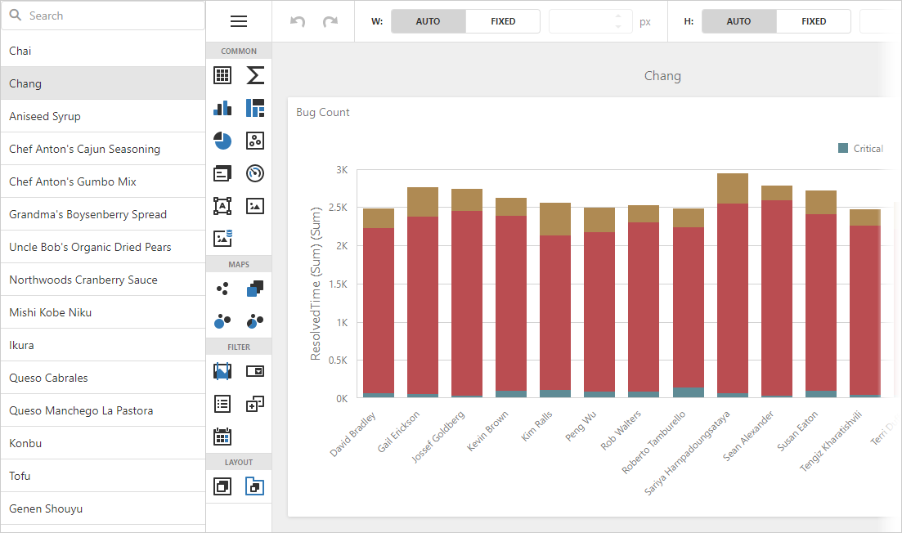

<!-- default badges list -->

<!-- default badges end -->
# BI Dashboard for ASP.NET Core - How to Implement a Custom Service and UI for Managing Dashboards List

This example shows how to create a custom list of dashboards similar to the [Dashboard Panel](https://docs.devexpress.com/Dashboard/119771/web-dashboard/ui-elements-and-customization/ui-elements/dashboard-panel).

The [DevExtreme ASP.NET Data](https://github.com/DevExpress/DevExtreme.AspNet.Data) package's API is used to prepare a list of dashboard names with their IDs. Identifiers are based on the `Products` table from the `Northwind` database and accessed through the [Entity Framework Core](https://docs.microsoft.com/en-us/ef/core). The `DashboardPanelController.Dashboards` action method call returns this list.

You need to implement the custom [dashboard storage](https://docs.devexpress.com/Dashboard/DevExpress.DashboardWeb.IDashboardStorage) to store dashboards. Call the [IDashboardStorage.LoadDashboard](https://docs.devexpress.com/Dashboard/DevExpress.DashboardWeb.IDashboardStorage.LoadDashboard(System.String)) method to return the corresponding dashboard from this storage. This example uses a single dashboard XML template (the `DashboardTemplate.xml` file) and only modifies the dashboard's title to emulate different dashboards. In this particular usage scenario, you can store dashboard layouts in the database and load them from here (for example, see [Dashboard for ASP.NET Core - How to load and save dashboards from/to a database](https://github.com/DevExpress-Examples/asp-net-core-dashboard-save-dashboards-to-database)).

The [List](https://docs.devexpress.com/AspNetCore/400778/devextreme-based-controls/controls/list) control is used to load and display the list of dashboards. The [searchEnabled](https://js.devexpress.com/Angular/Documentation/ApiReference/UI_Components/dxList/Configuration/#searchEnabled) option of this control is enabled to allow search. You can use other widget options to enable the required functionality. For example, the [itemDragging.allowReordering](https://js.devexpress.com/Documentation/ApiReference/UI_Components/dxSortable/Configuration/#allowReordering) option allows end users to reorder items (see [Item Drag &amp; Drop](https://demos.devexpress.com/ASPNetCore/Demo/List/ItemDragging)).

> **NOTE:** This example uses the `ProductID` database field as a dashboard's ID. The field's type is `number` while the [DashboardInfo.ID](https://docs.devexpress.com/Dashboard/DevExpress.DashboardWeb.DashboardInfo.ID) property and the [IDashboardStorage.LoadDashboard](https://docs.devexpress.com/Dashboard/DevExpress.DashboardWeb.IDashboardStorage.LoadDashboard(System.String)) method's argument type is `string`. It is necessary to convert types. In this example, this is done in the `NorthwindContext.OnModelCreating` method (see [NorthwindContext.cs](./CS/Models/NorthwindContext.cs)).

## Files to Review

* [Startup.cs](./CS/Program.cs)
* [DashboardPanelController.cs](./CS/Controllers/DashboardPanelController.cs)
* [CustomDashboardStorage.cs](./CS/Code/CustomDashboardStorage.cs)
* [Product.cs](./CS/Models/Product.cs)
* [NorthwindContext.cs](./CS/Models/NorthwindContext.cs)
* [Index.cshtml](./CS/Pages/Index.cshtml)

## Documentation

- [Prepare Dashboard Storage](https://docs.devexpress.com/Dashboard/16979/web-dashboard/dashboard-backend/prepare-dashboard-storage)
- [Client-Side API Overview for ASP.NET Core Dashboard](https://docs.devexpress.com/Dashboard/400192/web-dashboard/aspnet-core-dashboard-control/client-side-api-overview)

## More Examples

- [Dashboard for Angular - How to Implement a Custom Service and UI for Managing Dashboards List](https://github.com/DevExpress-Examples/angular-dashboard-custom-panel)
- [Dashboard for ASP.NET Core - How to load and save dashboards from/to a database](https://github.com/DevExpress-Examples/asp-net-core-dashboard-save-dashboards-to-database)
